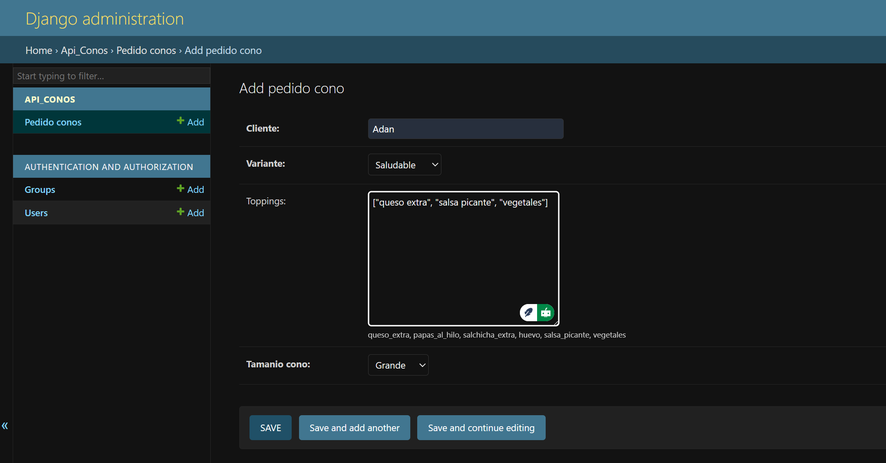
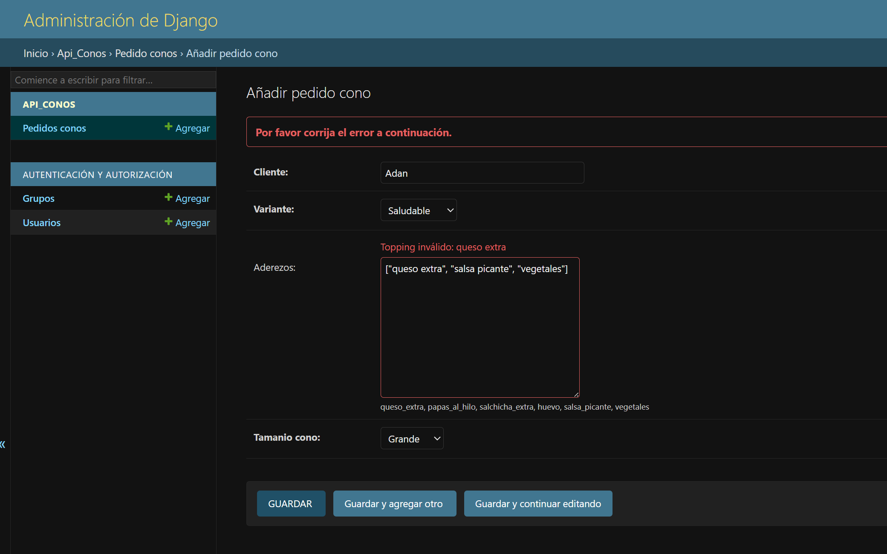
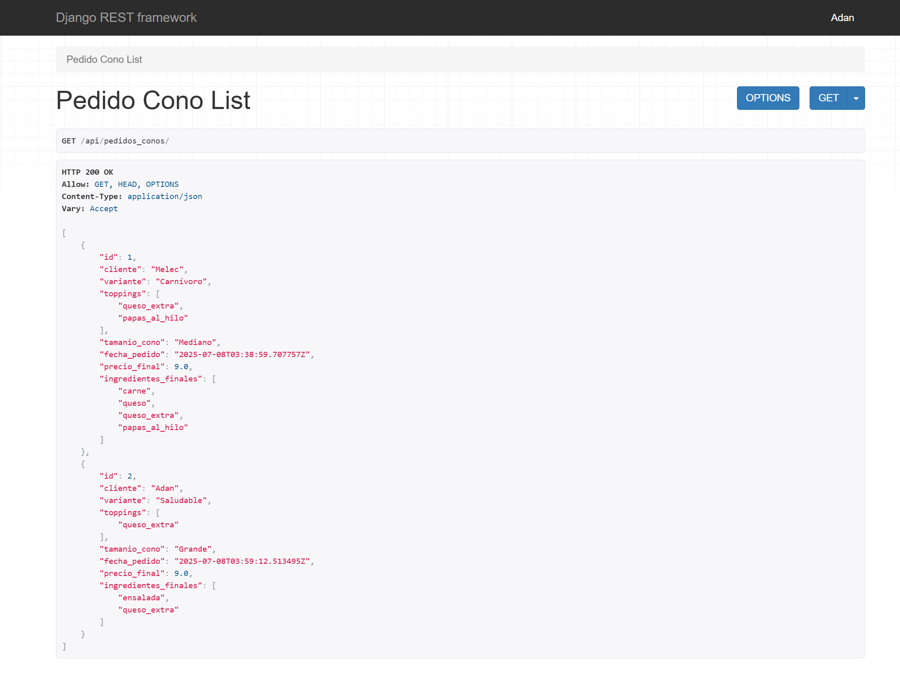
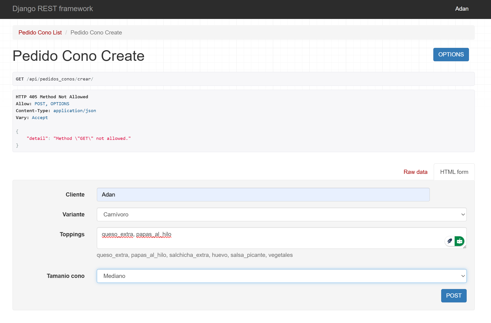
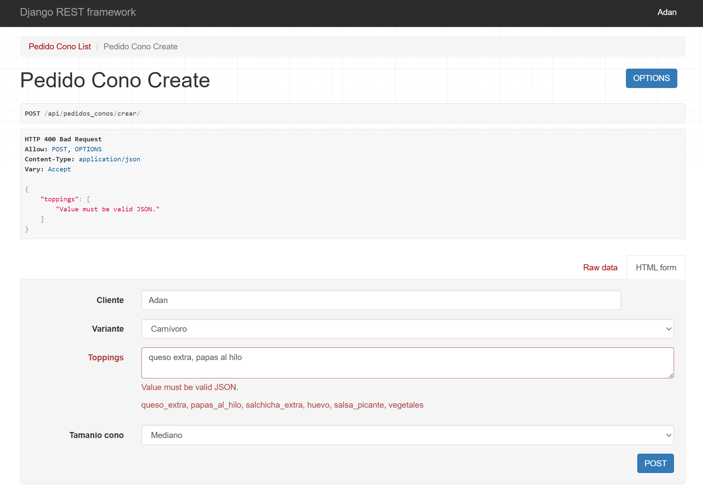

## PARCIAL 2 - Patrones de Diseño en Django

---

### Nombre: Cortez Reyes Adan
### Curso: Segundo
### Materia: Programación 2
### Fecha: 07/07/2025

---

## Descripción de cada patrón de diseño en uno de los métodos implementados:

## 1. **Builder**
- **Dónde se aplica:** En la clase `ConoBuilder` (ver archivo `builder.py`).
- **Cómo se aplica:** Permite construir un objeto "Cono" paso a paso, agregando toppings y definiendo el tamaño de manera flexible. Por ejemplo, en el método `get_precio_final` del serializer, se utiliza el builder para calcular el precio final del pedido según los toppings y el tamaño seleccionados.

## 2. **Factory Method**
- **Dónde se aplica:** En la clase `ConoFactory` (ver archivo `factory.py`).
- **Cómo se aplica:** Se encarga de instanciar el tipo de cono adecuado según la variante elegida por el usuario (Carnívoro, Vegetariano o Saludable). Esto se utiliza en los métodos del serializer para obtener la base del cono antes de aplicar el builder.

## 3. **Singleton**
- **Dónde se aplica:** En la clase `Logger` (ver archivo `logger.py`).
- **Cómo se aplica:** Garantiza que solo exista una instancia del logger en toda la aplicación. Se utiliza para registrar eventos importantes, como el cálculo del precio o la generación de ingredientes finales en los métodos del serializer.

---

## Aplicación de los Patrones de Diseño

A continuación se describe cómo se aplica cada patrón de diseño en uno de los métodos implementados en el sistema:

### 1. **Builder Pattern**
- **Dónde se aplica:** En la clase `ConoBuilder` (ver archivo `builder.py`).
- **Cómo se usa:** Permite construir un objeto "Cono" paso a paso, agregando toppings y definiendo el tamaño de manera flexible. Por ejemplo, en el método `get_precio_final` del serializer, se utiliza el builder para calcular el precio final del pedido según los toppings y el tamaño seleccionados.

### 2. **Factory Pattern**
- **Dónde se aplica:** En la clase `ConoFactory` (ver archivo `factory.py`).
- **Cómo se usa:** Se encarga de instanciar el tipo de cono adecuado según la variante elegida por el usuario (Carnívoro, Vegetariano o Saludable). Esto se utiliza en los métodos del serializer para obtener la base del cono antes de aplicar el builder.

### 3. **Singleton Pattern**
- **Dónde se aplica:** En la clase `Logger` (ver archivo `logger.py`).
- **Cómo se usa:** Garantiza que solo exista una instancia del logger en toda la aplicación. Se utiliza para registrar eventos importantes, como el cálculo del precio o la generación de ingredientes finales en los métodos del serializer.

---

## Capturas de pantalla del proyecto:

- Interfaz de registro desde el panel de administración:

- Validación de ingredientes desde el panel de administración:

- Listado de pedidos desde la API REST:

- Registro de pedidos desde la API REST:

- Validación de ingredientes desde la API REST:
